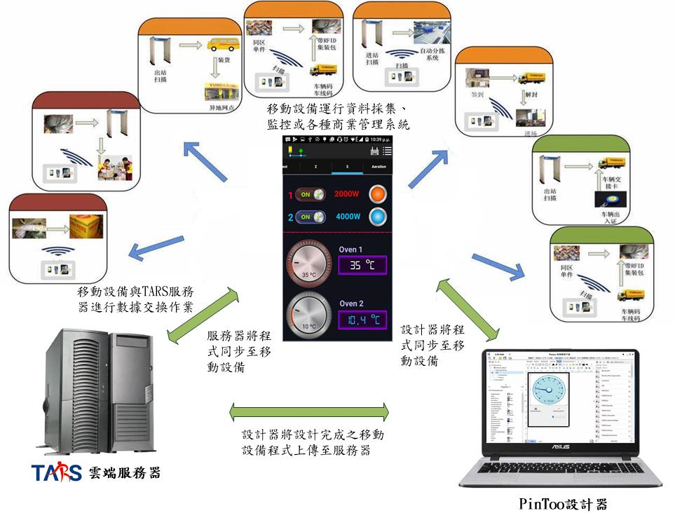
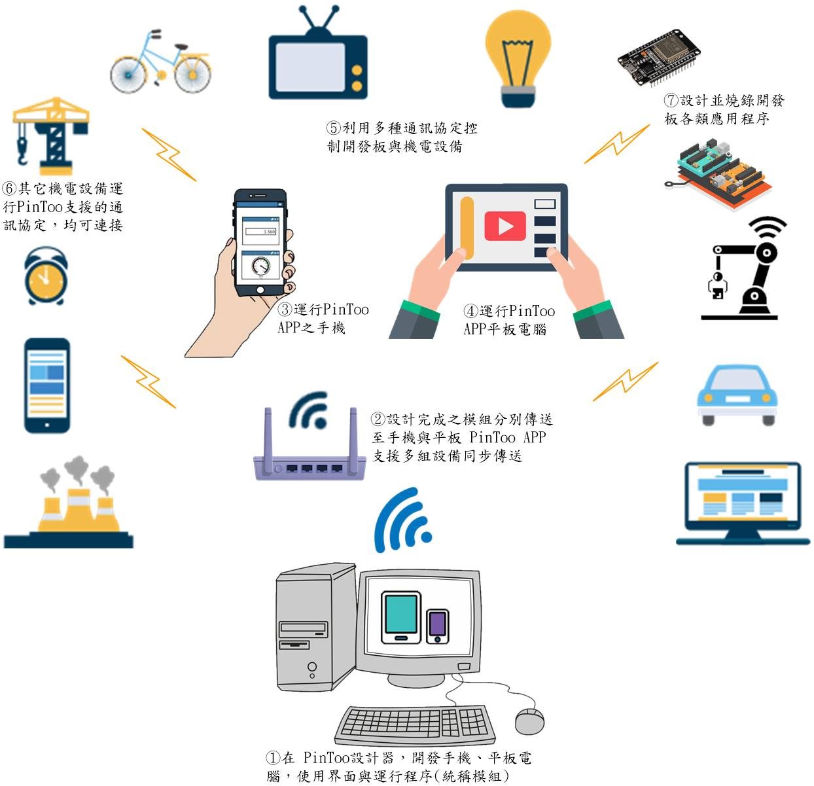
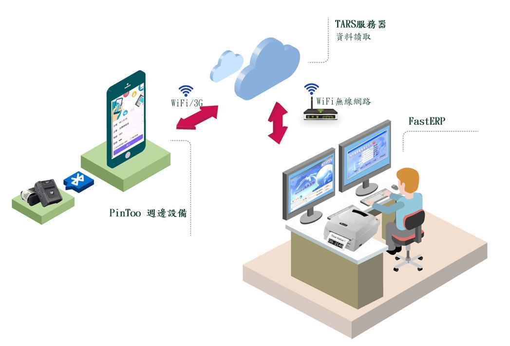
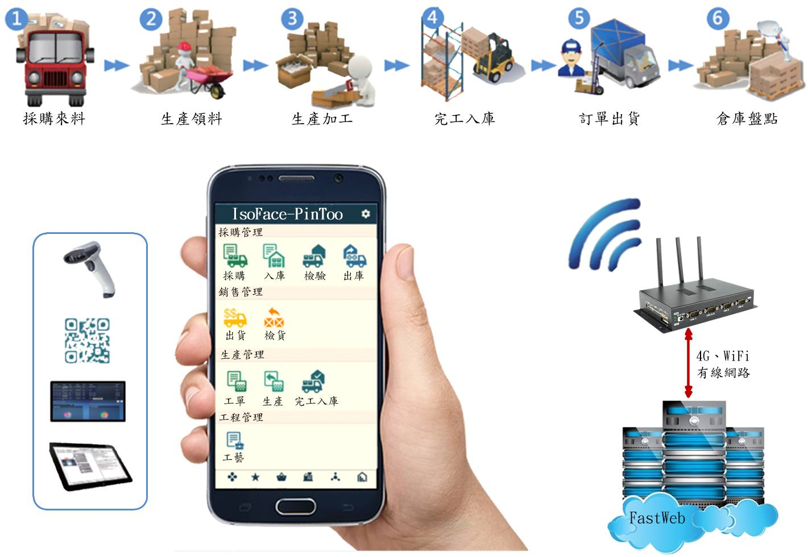
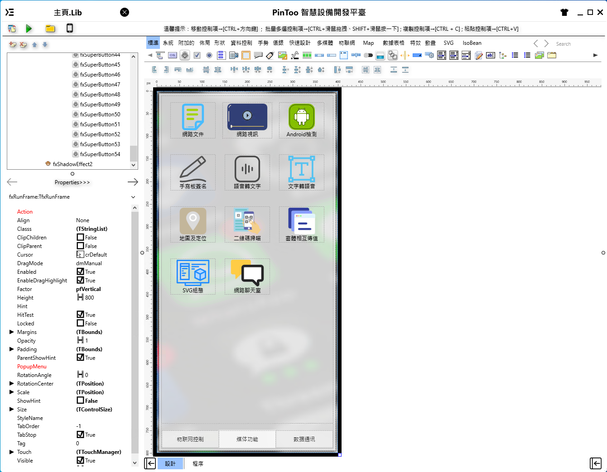
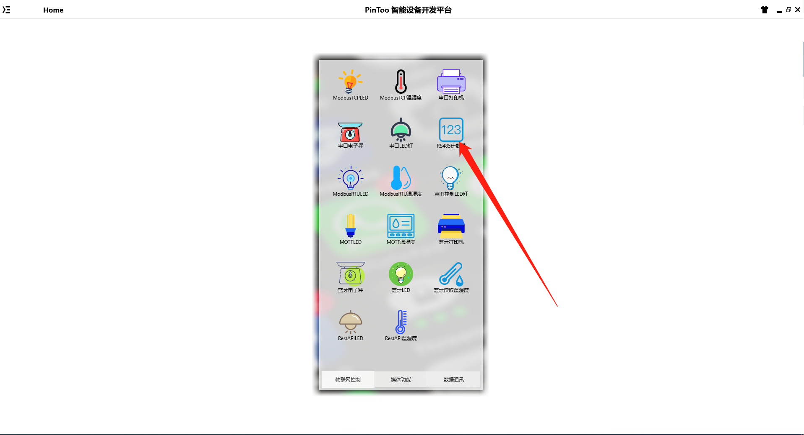
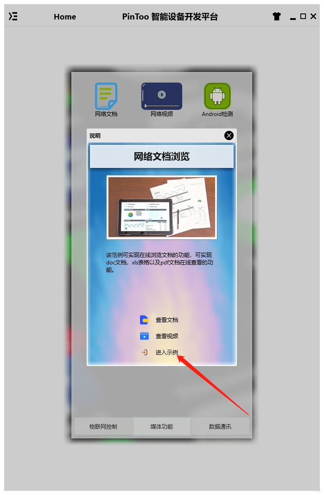
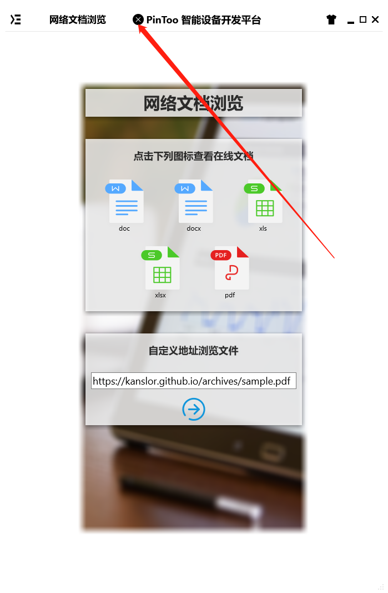

# PinToo 是 Android 移動設備開發平臺
PinToo 移動設備應用程式開發平臺，提供多層次開發框架，開發企業管理系統，只要有網路，無論何時、何地，快速開發APP。社區版非商業用途可免費使用。

> **加入 Facebook 社團**
>
> [https://www.facebook.com/groups/isoface/](https://www.facebook.com/groups/isoface/)
> 
> **點讚追蹤 Facebook 粉絲專頁**
> 
> [https://www.facebook.com/AIOT.ERP](https://www.facebook.com/AIOT.ERP)

PinToo 提供多層次開發框架，開發企業管理系統，只要有網路，無論何時、何地，快速開發APP。PinToo從系統設計、雛型設計到系統開發，最後到版本管理與佈署即系統文件印出一氣呵成，顛覆軟體設計工作模式並提供全新服務。PinToo是專為android手機或平板電腦設計的圖像化編程工具。以您為中心，量身打造各種商業運用與物聯網的整合。無論在工廠監控、ERP、電子商務…，就讓PinToo滿足您的想像。

PinToo引入智慧前端技術，造就了ERP應用系統的主流，隨著手機與平板的盛行，單純Web頁面已經無法滿足現代企業的需求。隨著行動裝置的普及與用戶使用習慣的改變，使用者以行動裝置上網查詢資料的比率，已經超過使用桌上型電腦或筆電。這結果就逼得所有知名網站與企業網站，都必須提供適合行動裝置所使用的APP程式。因此PinToo的智慧前端技術就此因應而生。 PinToo使用簡潔，直覺，強大的前端框架，讓管理系統的設置更快速、更簡單。PinToo的目地就是讓企業以更高的開發效率；滿足企業對於行動化的應用需求。

## 特色
1. 支援Android手機、平板、桌面電腦等不同螢幕大小解析度。
2. 提供基本範例程式碼，協助企業技術轉移與快速開發能力。
3. 支援IsoBean微服務，搭配精簡快速的設計功能，不會寫程式也可快速設計管理軟體。

## 範例目錄

`PinToo_Demo.pdb` 中為初始安裝包中附帶的範例資料庫檔案，其中包含有以下範例

|範例編號|範例名稱|
|---|---|
|p-el-dem-2001|通訊埠印表機|
|p-el-dem-2002|通訊埠電子秤|
|p-el-dem-2004|通訊埠控制 LED 燈|
|p-el-dem-2005|RS485 計數器|
|p-el-dem-2006|ModbusTCP 控制元件使用|
|p-el-dem-2007|ModbusTCP 控制 LED 燈|
|p-el-dem-2008|ModbusTCP 讀取溫濕度|
|p-el-dem-2010|ModbusRTU 控制 LED 燈|
|p-el-dem-2011|ModbusRTU 讀取溫濕度|
|p-el-dem-2012|WiFi 控制 LED 燈|
|p-el-dem-2013|MQTTClient 控制元件使用|
|p-el-dem-2014|MQTT 控制 LED 燈|
|p-el-dem-2015|MQTT 讀取溫濕度|
|p-el-dem-2017|藍芽印表機|
|p-el-dem-2018|藍芽電子秤|
|p-el-dem-2019|藍芽控制 LED 燈|
|p-el-dem-2020|藍芽讀取溫濕度|
|p-el-dem-2022|網路文件瀏覽|
|p-el-dem-2023|網路視訊播放|
|p-el-dem-2024|呼叫 Android 原生庫|
|p-el-dem-2025|圖表展示|
|p-el-dem-2026|TARS 數據存取|
|p-el-dem-2027|Flying 網路列印|
|p-el-dem-2028|自定 HTTP Server 伺服器|
|p-el-dem-2029|自定 HTTP Client 客戶端|
|p-el-dem-2030|簡訊發送|
|p-el-dem-2031|窗體相互傳值|
|p-el-dem-2032|手寫板簽名|
|p-el-dem-2033|二維碼產生|
|p-el-dem-2034|語音轉文字|
|p-el-dem-2035|文字轉語音|
|p-el-dem-2037|地圖及定位|
|p-el-dem-2041|RestAPI 控制 LED 燈|
|p-el-dem-2042|RestAPI 讀取溫濕度|
|p-el-dem-2043|SVG 組態|
|p-el-dem-2044|網路聊天室|

新增範例目錄的說明如下：

### 物聯網

|目錄名稱|對應範例名稱|
|-------|------------|
|[p-el-dem-2201_esp32cam_servo_car](demo/iot/p-el-dem-2201_esp32cam_servo_car/)|遙控小車|
|[p-el-dem-2202_esp32cam_slider](demo/iot/p-el-dem-2202_esp32cam_slider/)|ESP32CAM 滑軌照相機|
|[p-el-dem-2203_esp32_slider](demo/iot/p-el-dem-2203_esp32_slider/)|ESP32 滑軌照相機|
|[p-el-dem-2210_pms5003st_sensor](demo/iot/p-el-dem-2210_pms5003st_sensor/)|PM2.5 感測器數據讀取|
|[p-el-dem-2211_modbusrtu_elecmeter](demo/iot/p-el-dem-2211_modbusrtu_elecmeter/)|ModbusRTU 電錶數據讀取|

### 組態

|目錄名稱|對應範例名稱|
|-------|------------|
|[p-el-dem-2204_filltank_openplc](demo/scada/p-el-dem-2204_filltank_openplc/)|液化槽控制(OpenPLC)|
|[p-el-dem-2205_filltank_pintoo](demo/scada/p-el-dem-2205_filltank_pintoo/)|液化槽控制(PinToo)|
|[p-el-dem-2208_factory_robot_arm](demo/scada/p-el-dem-2208_factory_robot_arm/)|虛擬機器械臂控制|

### 媒體

|目錄名稱|對應範例名稱|
|-------|------------|
|[p-el-dem-2212_openmap](demo/media/p-el-dem-2212_openmap/)|地圖定位展示|

## 範例匯入方式

請注意，範例的匯入流程會將原有的模板資料庫覆蓋，在匯入其他模板資料庫之前請先備份已有的 `PinToo.pdb` 檔案。有以下兩種備份與打開方式。

**方法一**

將安裝目錄下的 `PinToo.pdb` 檔案複製一份，重新命名為其他名稱的檔案。打開 PinToo Design 設計器，進入至模組列表界面。選擇 `匯入資料庫`，選擇目錄中的示例 `pdb` 檔案 匯入至 PinToo Design 的模組列表中。

**方法二**

關閉 PinToo Design 設計器，將原先目錄下的 `PinToo.pdb` 做好備份，重新命名為其他名稱的檔案。將要打開的範例模板資料庫檔案重新命名為 `PinToo.pdb`。打開 PinToo Design 設計器可檢視匯入的模組資料庫檔案中的模組。

* **PinToo 簡介**：https://isoface.net/isoface/production/software/pintoo
* **PinToo下載**：[點選此處下載](https://github.com/isoface-iot/PinToo/releases/latest)
* **PinToo產品說明**：https://isoface.net/isoface/doc/pintoo/main/
* **PinToo 範例列表**：https://isoface.net/isoface/production/software/pintoo/pintoo-sample
* **PinToo 快速上手**：https://isoface.net/isoface/study/quick-start/2022-05-28-03-08-29/pintoo
* **PinToo 無需安裝，線上試用**：https://isoface.net/isoface/support/trial/pintoo

## PinToo 無需安裝，線上試用

PinToo開發測試為協助開發者，測試IDE界面設計、瀏覽系統管理功能，修改結果不能儲存。

[點選鏈接跳轉至測試系統。](https://www.diylogi.com)

使用者名稱：pintoo

密碼：demo

登錄系統后打開PinToo登錄界面，登錄界面預設的使用者名稱為admin，預設密碼為空。點選登錄按鈕可直接登錄主頁。所有專案均以圖示的形式呈現，點選對應的圖示即可進入到相應的說明界面中。

為保持最佳的體驗，在程式執行后，將程式顯示頁面最大化，之後在主頁上按住滑鼠下移下拉重新整理主頁面。由於平臺的限制，PC端無法實現PinToo的全部功能，建議在Android終端上安裝PinToo程式進行詳細體驗。

檢視模組開發界面

* 使用開發測試登錄
* 點選左上角功能表欄，選擇`界面設定`。
* 選擇要檢視的模板，點選`設計`按鈕。
* 開啟對應的模組設計界面，在界面中可檢視模組的窗體配置資訊。

詳情請檢視[PinToo快速上手](https://isoface.net/isoface/doc/pintoo/quick-start/)。

* PinToo範例選擇說明

登錄至PinToo主頁界面中，顯示的內容示例如下，如需要進入對應模組，點選對應模組的圖示。

PinToo中實現的模板主要有以下三種類型：

* **物聯網控制**：該分類下的示例需配合相關硬體進行使用，不能獨立啟動。
* **媒體功能**：該分類下的示例不需要結合硬體使用，其中部分示例需要連線Internet后才可使用。
* **數據通訊**：該分類下的示例需要結合資料庫連線，需為其配置帳套連線，無法單獨使用。

在進入示例前會有彈窗出現，對專案的內容進行說明，點選進入示例進入到對應的示例中。

在示例體驗結束后，點選左上角的關閉按鈕關閉目前頁的編輯，返回至上一個頁面。

