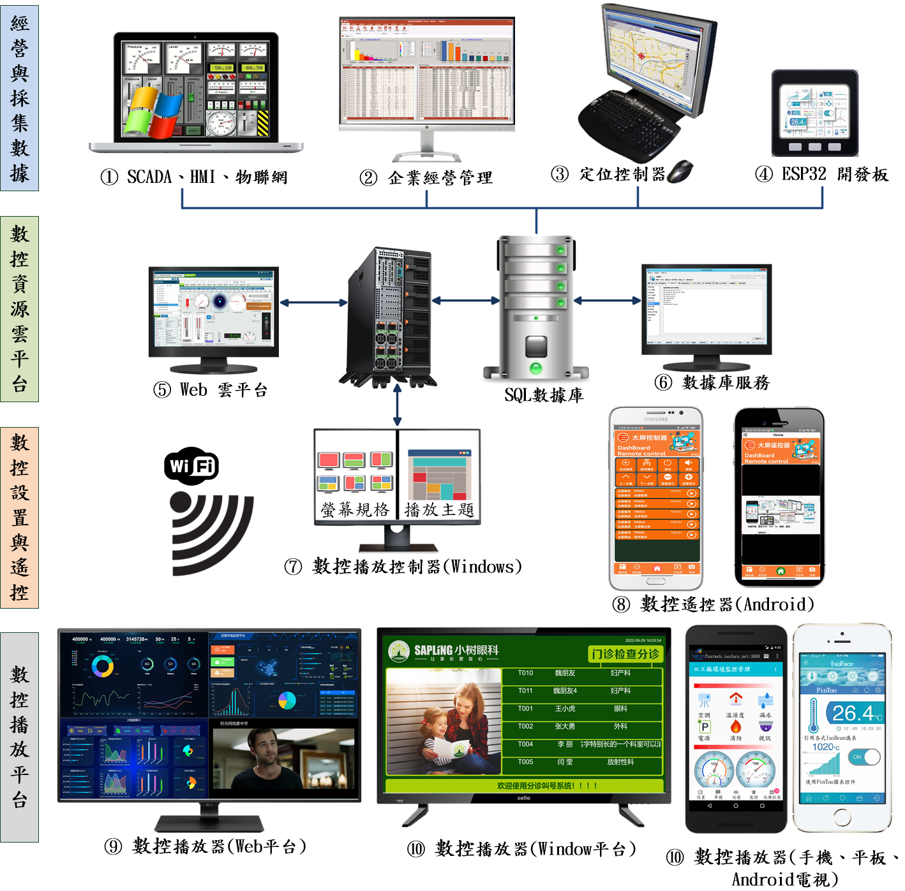
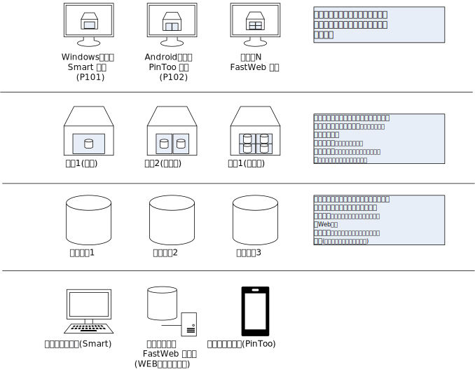

# 战情指挥系统

> **加入 Facebook 社團**
>
> [https://www.facebook.com/groups/isoface/](https://www.facebook.com/groups/isoface/)
> 
> **點讚追蹤 Facebook 粉絲專頁**
> 
> [https://www.facebook.com/AIOT.ERP](https://www.facebook.com/AIOT.ERP)

數控中心-戰情指揮系統是愛招飛針對數據大屏展示的播放器集群控制推出的解決方案，數控中心-戰情指揮系統可隨時動態調整每個播放器上顯示的內容，可顯示的內容包括數據大屏，視訊監控，人員定位，企業經營管理等。有了數控中心-戰情指揮系統，不再侷限於已有的大屏報表模板，您可以自己定製所需的大屏。

戰情指揮系統，整合企業各種管理數據，透過即時看板管理，呈現人、機、物的動態訊息，透過視覺化管理，建立監控機制，讓企業管理數據有跡可循。但是縱然有精闢的戰情數據，如果無法及時又快速的呈現在管理者眼前，往往失去經營先機。

戰情指揮系統，經由固定的條件設定。任意指定播放場域，無論是生產現場、會議室、遠端視訊會議，均能應對自如。戰情顯示可以分割不同子畫面，同時展現關聯內容，不放過任何資訊。以往想控制大屏上的顯示內容，都使用紅外線遙控器，現在人們普遍「機不離手」，戰情指揮系統使用手機控制大屏。只需在手機下載大屏遙控器應用程式，就可以連線播放器，控制大屏，開始遙控。而且手機的遙控介面比傳統的遙控器簡潔。

數控中心-戰情指揮系統有幾個基本的概念，特在此進行說明。

* **播放器**：播放、顯示內容的終端，這些終端設備上安裝有數控中心-戰情指揮系統的播放器程式。
* **主題**：播放顯示內容的樣式佈局，每個主題都有不同的樣式設計。
* **戰情**：播放顯示的內容，戰情可以是數據大屏展示或是視訊監控、企業經營管理等內容。

關於上述概念，下面一張圖可幫助理解。

關於數控中心的更多說明，請參閱以下內容：

* 數控中心-戰情指揮系統型錄：https://isoface.net/isoface/production/dcc/bigscreen
* 數控中心-戰情指揮系統說明：https://isoface.net/isoface/prodoc/dcc/bigscreen/main/

## 範例匯入方式

請注意，範例的匯入流程會將原有的模板資料庫覆蓋，在匯入其他模板資料庫之前請先備份已有的 `PinToo.pdb` 檔案。有以下兩種備份與打開方式。

**方法一**

將安裝目錄下的 `PinToo.pdb` 檔案複製一份，重新命名為其他名稱的檔案。打開 PinToo Design 設計器，進入至模組列表界面。選擇 `匯入資料庫`，選擇目錄中的示例 `pdb` 檔案 匯入至 PinToo Design 的模組列表中。

**方法二**

關閉 PinToo Design 設計器，將原先目錄下的 `PinToo.pdb` 做好備份，重新命名為其他名稱的檔案。將要打開的範例模板資料庫檔案重新命名為 `PinToo.pdb`。打開 PinToo Design 設計器可檢視匯入的模組資料庫檔案中的模組。

* **PinToo 簡介**：https://isoface.net/isoface/production/software/pintoo
* **PinToo下載**：[點選此處下載](https://github.com/isoface-iot/PinToo/releases/latest)
* **PinToo產品說明**：https://isoface.net/isoface/doc/pintoo/main/
* **PinToo 範例列表**：https://isoface.net/isoface/production/software/pintoo/pintoo-sample
* **PinToo 快速上手**：https://isoface.net/isoface/study/quick-start/software/pintoo
* **PinToo 無需安裝，線上試用**：https://isoface.net/isoface/support/trial/pintoo