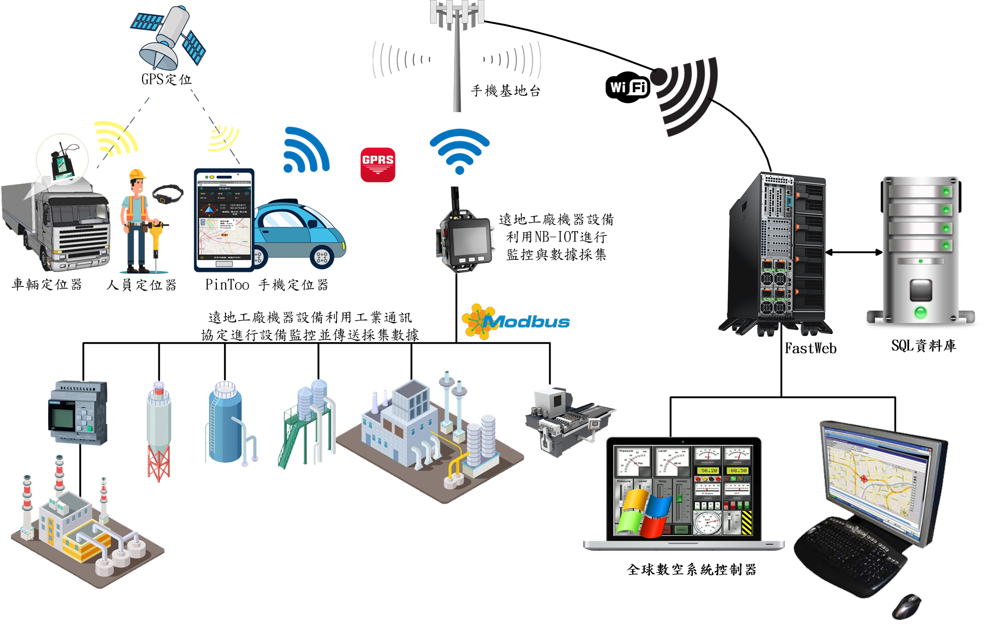

# 人車定位系統

> **加入 Facebook 社團**
>
> [https://www.facebook.com/groups/isoface/](https://www.facebook.com/groups/isoface/)
> 
> **點讚追蹤 Facebook 粉絲專頁**
> 
> [https://www.facebook.com/AIOT.ERP](https://www.facebook.com/AIOT.ERP)

利用 GPS 定位系統與開放的 OpenStreetMap，自製企業地圖。掌控企業因公外出之人、車、物..最新地理位址與動態，與客戶、廠商的相對關係。同時呈現在企業地圖中一覽無遺。全球數控系統超越硬體與網路傳輸限制，提供使用者智慧影像擷取服務，使用工業通訊協定，將遠地機器設備、資產、進行地圖定位與即時監控、採集數據。所有定位與採集監控數據回傳雲端平臺，精準掌握企業脈動。

數控中心-定位系統是愛招飛針對企業的人員、車輛、物件的定位需求提供的解決方案，它使用地圖作為大屏展示，相關的人、物定位資訊展示于地圖中，可在定位服務系統中查詢到追蹤對像目前所處的位置，歷史移動的軌跡，以及發送實時圖文訊息等功能。

關於數控中心的更多說明，請參閱以下內容：

* 數控中心-定位系統型錄：https://isoface.net/isoface/production/dcc/gps
* 數控中心-戰情指揮系統說明：https://isoface.net/isoface/prodoc/dcc/gps/main/

## 範例匯入方式

請注意，範例的匯入流程會將原有的模板資料庫覆蓋，在匯入其他模板資料庫之前請先備份已有的 `PinToo.pdb` 檔案。有以下兩種備份與打開方式。

**方法一**

將安裝目錄下的 `PinToo.pdb` 檔案複製一份，重新命名為其他名稱的檔案。打開 PinToo Design 設計器，進入至模組列表界面。選擇 `匯入資料庫`，選擇目錄中的示例 `pdb` 檔案 匯入至 PinToo Design 的模組列表中。

**方法二**

關閉 PinToo Design 設計器，將原先目錄下的 `PinToo.pdb` 做好備份，重新命名為其他名稱的檔案。將要打開的範例模板資料庫檔案重新命名為 `PinToo.pdb`。打開 PinToo Design 設計器可檢視匯入的模組資料庫檔案中的模組。

* **PinToo 簡介**：https://isoface.net/isoface/production/software/pintoo
* **PinToo下載**：[點選此處下載](https://github.com/isoface-iot/PinToo/releases/latest)
* **PinToo產品說明**：https://isoface.net/isoface/doc/pintoo/main/
* **PinToo 範例列表**：https://isoface.net/isoface/production/software/pintoo/pintoo-sample
* **PinToo 快速上手**：https://isoface.net/isoface/study/quick-start/software/pintoo
* **PinToo 無需安裝，線上試用**：https://isoface.net/isoface/support/trial/pintoo