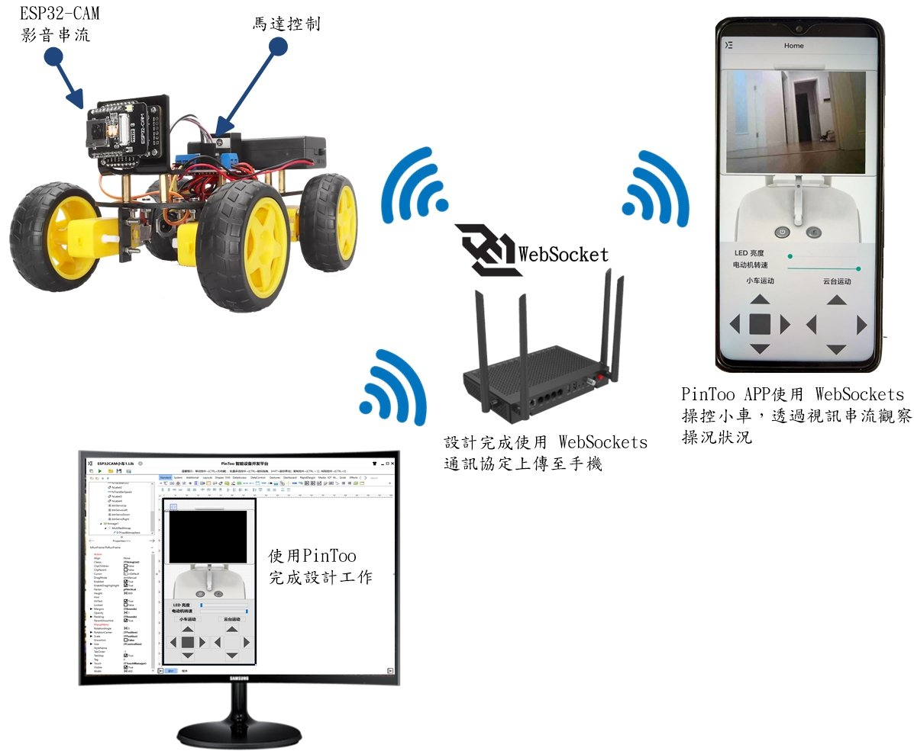
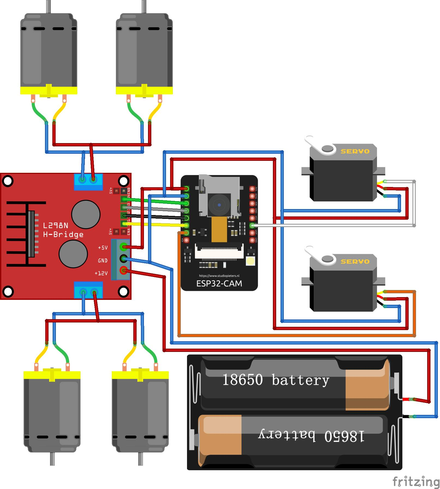

# PinToo ESP32CAM 監控雲臺小車

PinToo 移動設備應用程式開發平臺，提供多層次開發框架，開發企業管理系統，只要有網路，無論何時、何地，快速開發APP。社區版功能無差別，全部免費。

> **加入 Facebook 社團**
>
> [https://www.facebook.com/groups/isoface/](https://www.facebook.com/groups/isoface/)
> 
> **點讚追蹤 Facebook 粉絲專頁**
> 
> [https://www.facebook.com/AIOT.ERP](https://www.facebook.com/AIOT.ERP)

PinToo 將 APP 設計成 WebSocket Server，所有開發板(Arduino、ESP8266、ESP32、RaspBerry ....)都能使用 WebSocket Client 與 PinToo 組成綿密的物聯網，只要有網路地方，無論多遠都能相互監控、採集數據。發揮自己的想像空間，自行快速設計 Android 手機 APP 應用軟體，無需依靠其他工具。
　　　
外行人看熱鬧，內行人看的是門道，手機遙控 ESP32-CAM 小車，Google 網路搜尋一大把，功能百百種，但是核心重點在哪，開發者不說您可能也不會知道！
　
通訊服務是手機遙控 ESP32-CAM 小車的終極心臟，如果只是驅動馬達前進後退、小車左轉右轉，瀏覽車前視訊，即使是外觀再豪華，也只能算是金玉其外、毫無內涵的小車而已！因為 PinToo APP 具備 WebSocket Server 功能，開發板採用 WebSocket Client 通訊協定，所以PinToo APP 就能發送指令控制開發板。但是也能反過來使用，利用開發板控制手機中的 PinToo APP 進行任何操作。該功能完全顛覆之前的做法，能做的事情又更多了。Smart 與 FastWeb 也同樣具備 WebSocket Server 功能，所以開發板也能透過 Smart 控制 Windows，利用 FastWeb 進行 Web 各種組合運用。它們之間產生了多種化學變化，激盪出更深層的運用。所以手機遙控 ESP32-CAM 小車，只是驗證這項功能可以實現，Maker 可以利用這方法新創更傑出的應用項目。

## 控制重點
* 使用 WebSocket 通訊協定控制小車
* 通過視訊串流連線 ESP32-CAM 攝像頭，即時監控行車狀況

　　
## 使用控制裝置
* ESP32CAM 開發板 含攝影機模組
* USB-TTL 下載燒錄器 （Arduino 燒錄程式用）
* L298N電機驅動板
* 減速馬達
* SG90舵機

　　
## 使用工業通訊協定
WebSocket
　　
## 使用開發軟體
PinToo APP 軟件開發工具

## 範例匯入方式

請注意，範例的匯入流程會將原有的模板資料庫覆蓋，在匯入其他模板資料庫之前請先備份已有的 `PinToo.pdb` 檔案。有以下兩種備份與打開方式。

**方法一**

將安裝目錄下的 `PinToo.pdb` 檔案複製一份，重新命名為其他名稱的檔案。打開 PinToo Design 設計器，進入至模組列表界面。選擇 `匯入資料庫`，選擇目錄中的示例 `pdb` 檔案 匯入至 PinToo Design 的模組列表中。

**方法二**

關閉 PinToo Design 設計器，將原先目錄下的 `PinToo.pdb` 做好備份，重新命名為其他名稱的檔案。將要打開的範例模板資料庫檔案重新命名為 `PinToo.pdb`。打開 PinToo Design 設計器可檢視匯入的模組資料庫檔案中的模組。

* **PinToo 簡介**：https://isoface.net/isoface/production/software/pintoo
* **PinToo下載**：[點選此處下載](https://github.com/isoface-iot/PinToo/releases/latest)
* **PinToo產品說明**：https://isoface.net/isoface/doc/pintoo/main/
* **PinToo 範例列表**：https://isoface.net/isoface/production/software/pintoo/pintoo-sample
* **PinToo 快速上手**：https://isoface.net/isoface/study/quick-start/2022-05-28-03-08-29/pintoo
* **PinToo 無需安裝，線上試用**：https://isoface.net/isoface/support/trial/pintoo