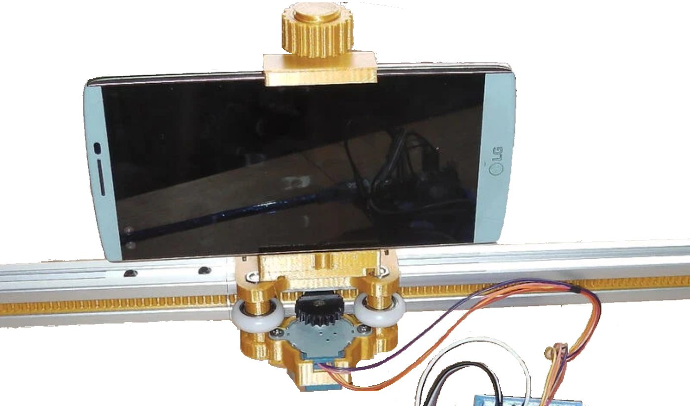
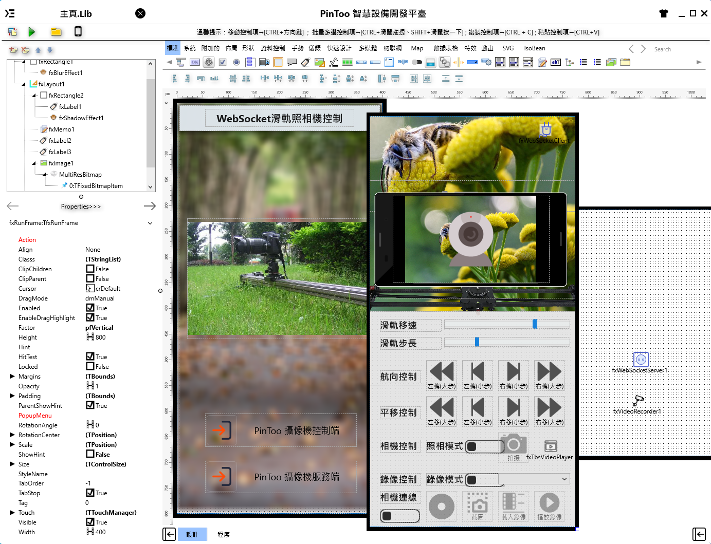
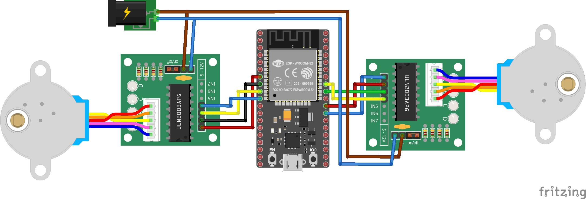

# Android 手機開發工具 PinToo，開發照相機滑軌控制系統

PinToo 移動設備應用程式開發平臺，提供多層次開發框架，開發企業管理系統，只要有網路，無論何時、何地，快速開發APP。社區版功能無差別，全部免費。

> **加入 Facebook 社團**
>
> [https://www.facebook.com/groups/isoface/](https://www.facebook.com/groups/isoface/)
> 
> **點讚追蹤 Facebook 粉絲專頁**
> 
> [https://www.facebook.com/diylogi](https://www.facebook.com/diylogi)

軌道平臺放置 Android 手機服務端，執行視訊串流服務。

## 說明
手機開發工具 PinToo 使用 WebSocket 通訊協議，控制照相機滑軌，照相機滑軌使用 ESP32 開發板控制步進馬達。左右移動滑軌平臺上方的手機。遠端手機進行上述控制，並可操控照相與攝影等功能。

## 照相機滑軌控制系統，共分成三部份
1. ESP32 開發板

    ESP32 開發板運用 WebSocket 客戶端程式庫，使用 Arduino IDE 燒錄 ino 程式，接收 WebSocket 訊號，控制滑軌平臺左右移動。

2. Android 手機服務端

    照相機滑軌平臺上，架設 Android 手機，安裝滑軌控制系統並執行服務端，提供即時視訊串流與 WebSocket服務。
　　
3. Android 手機控制端
    
    在 Android 手機安裝安裝滑軌控制系統。

## 控制重點
使用 PinToo 手機開發工具設計的照相機滑軌控制系統，接收手機服務端發送的視訊流，實現對視訊直播流的截圖拍照或視訊錄製的功能。
　　
ESP32 開發板使用 WebSocket 協議連線至控制步進電機的馬達，通過 WebSocket 發送指令實現滑軌的運動操作。

## 使用控制裝置

|序號|零件名稱|數量|
|---|---|---|
|1|NodeMCU ESP32S|1|
|2|28BYJ-48 步進電機(帶驅動板)|2|
|3|滑軌軌道套裝|1|
|4|杜邦線|若干|

## 注意事項
開發板的硬體連線圖原始檔在 Fritzing 資料夾中，可使用 Fritzing 打開以檢視。

ino 程式請使用 Arduino IDE 開啟並進行燒錄工作。

## 範例匯入方式

請注意，範例的匯入流程會將原有的模板資料庫覆蓋，在匯入其他模板資料庫之前請先備份已有的 `PinToo.pdb` 檔案。有以下兩種備份與打開方式。

**方法一**

將安裝目錄下的 `PinToo.pdb` 檔案複製一份，重新命名為其他名稱的檔案。打開 PinToo Design 設計器，進入至模組列表界面。選擇 `匯入資料庫`，選擇目錄中的示例 `pdb` 檔案 匯入至 PinToo Design 的模組列表中。

**方法二**

關閉 PinToo Design 設計器，將原先目錄下的 `PinToo.pdb` 做好備份，重新命名為其他名稱的檔案。將要打開的範例模板資料庫檔案重新命名為 `PinToo.pdb`。打開 PinToo Design 設計器可檢視匯入的模組資料庫檔案中的模組。

* **PinToo 簡介**：https://isoface.net/isoface/production/software/pintoo
* **PinToo下載**：[點選此處下載](https://github.com/isoface-iot/PinToo/releases/latest)
* **PinToo產品說明**：https://isoface.net/isoface/doc/pintoo/main/
* **PinToo 範例列表**：https://isoface.net/isoface/production/software/pintoo/pintoo-sample
* **PinToo 快速上手**：https://isoface.net/isoface/study/quick-start/2022-05-28-03-08-29/pintoo
* **PinToo 無需安裝，線上試用**：https://isoface.net/isoface/support/trial/pintoo