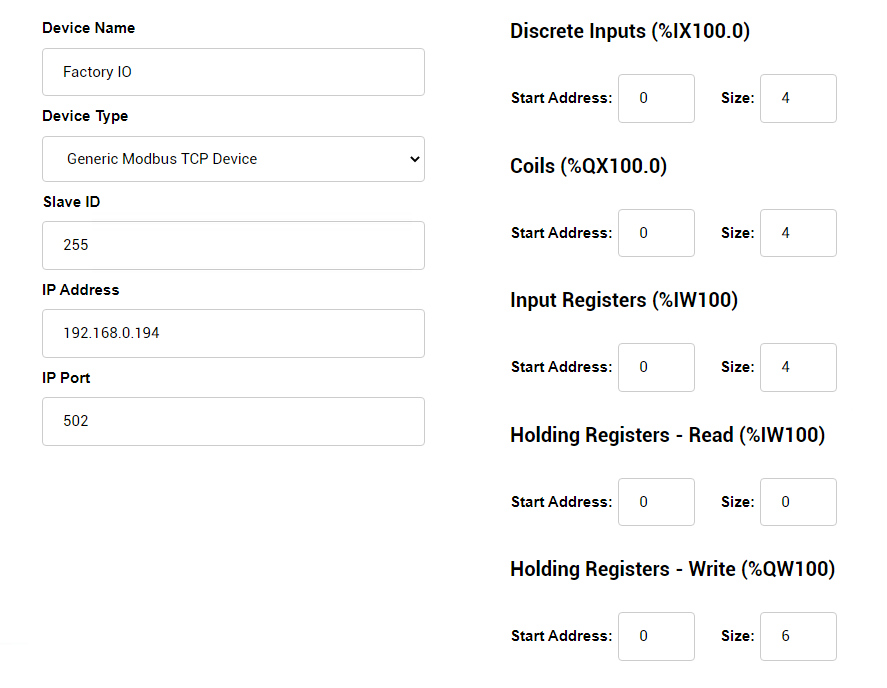

# PinToo 液化槽控制(OpenPLC)

> **請加入【物聯網、智聯網、ERP、視訊、監控，快速整合開發】社團，掌握產品最新動態**
>
> [https://www.facebook.com/groups/535849751457439](https://www.facebook.com/groups/535849751457439)

PinToo 可通過ModbusTCP 讀取OpenPLC中的數據，實現對 Factory IO 場景的控制。

PLC的全稱是可程式設計邏輯控制器（Programmable Logic Controller），是一種具有微處理機的數位電子裝置，用於自動化控制的數字邏輯控制器，在工業控制領域得到廣泛的運用。OpenPLC 是一款易於使用的開源可程式設計邏輯控制器（Programmable Logic Controller, 簡稱 PLC），根據 IEC 61131-3 標準所建立，該標準定義了 PLC 基本的軟體架構和程式語言。OpenPLC 主要使用於工業和家庭自動化、物聯網和 SCADA 研究。

Factory IO是一款出色的虛擬模擬軟體，可以自由使用其內部的各種元器件、感測器、驅動器等搭建自己理想中的工業現場，並聯合PLC進行程式設計模擬。

範例目錄中已提供了場景的專案檔案，可直接在Factory IO 中打開，此場景的製作方式如下：

在Factory IO 中建立一個空白場景。在工作站分類中找到 `Tank`，將其拖放至場景中，使用滑鼠右鍵點選零件，將配置修改爲 `Analog`。

接下來選擇驅動方式，點選功能表欄中的 `檔案-驅動`，在下拉框中選擇驅動的方式為 `Modbus TCP/IP Server`，點選右側的 `配置` 按鈕，將從站ID 修改爲 `255`，輸入、輸出點按照圖示進行設定。

返回驅動界面，界面中暫存器分配設定如下：

打開OpenPLC管理後臺界面，選擇 `Slave Devices`，在列表界面中點選 `Add new device`，建立的裝置根據 Factory IO 中的驅動地址進行修改。

設定完成後，點選 `Save device` 儲存。

接下來上傳PLC程式，將專案檔案 `Fill_Tank.zip` 解壓縮。OpenPLC管理後臺界面選擇 `Programs`，選擇上傳其中的 `*.st` 檔案，上傳並儲存，OpenPLC將重新編譯程式，編譯完成後，返回主界面，並點選 `Start PLC` 啟動PLC。

OpenPLC啟動后，可點選場景執行，測試執行情況。

打開 PinToo 設計界面進行場景設計，設計完成的樣式如下：

設計關聯的事件程式碼，最終的執行狀態如下：

* **產品**：https://isoface.net/isoface/production/software/pintoo
* **產品說明**：https://isoface.net/isoface/doc/pintoo/main/
* **網址**：https://isoface.net/