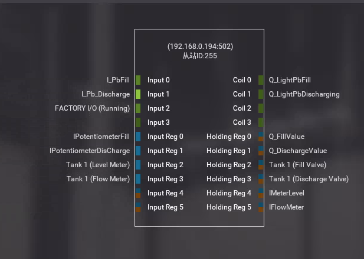

# PinToo 液化槽控制(PinToo)

PinToo 移動設備應用程式開發平臺，提供多層次開發框架，開發企業管理系統，只要有網路，無論何時、何地，快速開發APP。社區版功能無差別，全部免費。

> **請加入【物聯網、智聯網、ERP、視訊、監控，快速整合開發】社團，掌握產品最新動態**
>
> [https://www.facebook.com/groups/535849751457439](https://www.facebook.com/groups/535849751457439)

PinToo 可藉由 ModbusTCP 讀取實際場景Modbus Slave中的數據，實現對 Factory IO 場景的控制。

PLC的全稱是可程式設計邏輯控制器（Programmable Logic Controller），是一種具有微處理機的數位電子裝置，用於自動化控制的數字邏輯控制器，在工業控制領域得到廣泛的運用。PLC 主要使用於工業和家庭自動化、物聯網和 SCADA 研究。

Factory IO是一款出色的虛擬模擬軟體，可以自由使用其內部的各種元器件、感測器、驅動器等搭建自己理想中的工業現場，並聯合PLC進行程式設計模擬。

範例目錄中已提供了場景的專案檔案，可直接在Factory IO 中打開，此場景的製作方式如下：

在Factory IO 中建立一個空白場景。在工作站分類中找到 `Tank`，將其拖放至場景中，使用滑鼠右鍵點選零件，將配置修改爲 `Analog`。

接下來選擇驅動方式，點選功能表欄中的 `檔案-驅動`，在下拉框中選擇驅動的方式為 `Modbus TCP/IP Server`，點選右側的 `配置` 按鈕，將從站ID 修改爲 `255`，輸入、輸出點按照圖示進行設定。

返回驅動界面，界面中暫存器分配設定如下：

打開 PinToo 設計界面進行場景設計，設計完成的樣式如下：

設計關聯的事件程式碼，最終的執行狀態如下：

## 範例匯入方式

請注意，範例的匯入流程會將原有的模板資料庫覆蓋，所在在匯入其他模板資料庫之前請先備份已有的 `PinToo.pdb` 檔案。

將安裝目錄下的 `PinToo.pdb` 檔案複製一份，重新命名為其他名稱的檔案。

打開 PinToo Design 設計器，進入至模組列表界面。選擇 `匯入資料庫`，選擇目錄中的示例 `pdb` 檔案 匯入至 PinToo Design 的模組列表中。

將原先目錄下的 `PinToo.pdb` 做好備份，將複製的檔案重新命名為 `PinToo.pdb`。重新打開 PinToo Design 設計器可檢視匯入的模組資料庫檔案中的模組。

* **產品**：https://isoface.net/isoface/production/software/pintoo
* **產品說明**：https://isoface.net/isoface/doc/pintoo/main/
* **網址**：https://isoface.net/