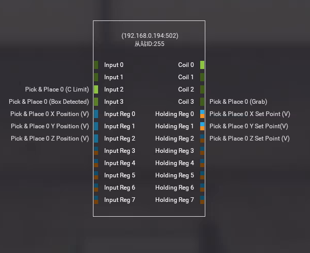
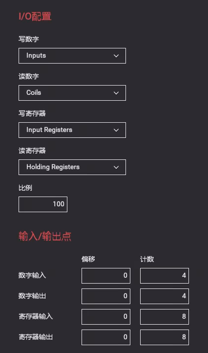
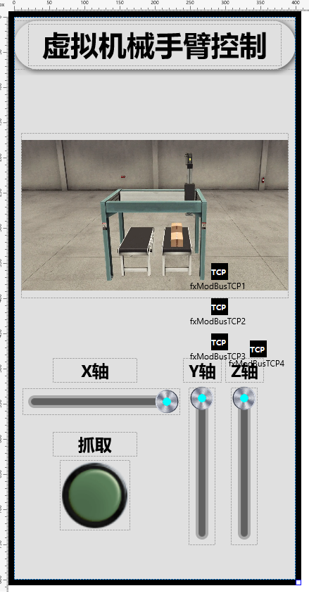
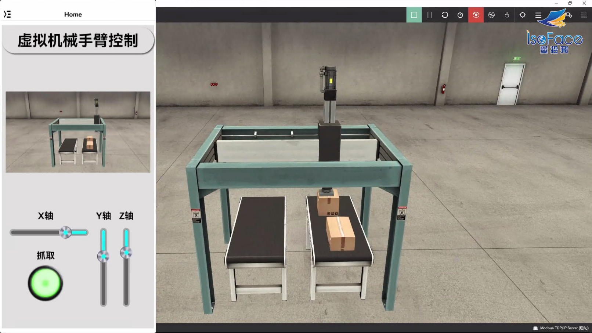

# PinToo 虛擬機器械臂

PinToo 移動設備應用程式開發平臺，提供多層次開發框架，開發企業管理系統，只要有網路，無論何時、何地，快速開發APP。社區版功能無差別，全部免費。

> **加入 Facebook 社團**
>
> [https://www.facebook.com/groups/isoface/](https://www.facebook.com/groups/isoface/)
> 
> **點讚追蹤 Facebook 粉絲專頁**
> 
> [https://www.facebook.com/diylogi](https://www.facebook.com/diylogi)

通過PinToo 的ModbusTCP來控制虛擬場景中的機械臂的移動。實現對 Factory IO 場景的控制。

Factory IO是一款出色的虛擬模擬軟體，可以自由使用其內部的各種元器件、感測器、驅動器等搭建自己理想中的工業現場，並聯合PLC進行程式設計模擬。

範例目錄中已提供了場景的專案檔案，可直接在Factory IO 中打開。

在場景中選擇驅動方式，點選功能表欄中的 `檔案-驅動`，在下拉框中選擇驅動的方式為 `Modbus TCP/IP Server`，點選右側的 `配置` 按鈕，將從站ID 修改爲 `255`。

啟動PinToo，在模組設計界面點選 `匯入資料庫` ，將 `PinToo_Arm.pdb` 匯入至模組設計界面列表中。進入至模組設計界面，確認 `fxModbusTCP` 中的 `Host` 屬性已修改爲虛擬場景軟體指定的地址。

設計界面顯示如下：

切換至發佈中心，將模組發佈至已連線的裝置。執行場景與裝置，檢視控制的效果。

## 範例匯入方式

請注意，範例的匯入流程會將原有的模板資料庫覆蓋，在匯入其他模板資料庫之前請先備份已有的 `PinToo.pdb` 檔案。有以下兩種備份與打開方式。

**方法一**

將安裝目錄下的 `PinToo.pdb` 檔案複製一份，重新命名為其他名稱的檔案。打開 PinToo Design 設計器，進入至模組列表界面。選擇 `匯入資料庫`，選擇目錄中的示例 `pdb` 檔案 匯入至 PinToo Design 的模組列表中。

**方法二**

關閉 PinToo Design 設計器，將原先目錄下的 `PinToo.pdb` 做好備份，重新命名為其他名稱的檔案。將要打開的範例模板資料庫檔案重新命名為 `PinToo.pdb`。打開 PinToo Design 設計器可檢視匯入的模組資料庫檔案中的模組。

* **PinToo 簡介**：https://isoface.net/isoface/production/software/pintoo
* **PinToo下載**：[點選此處下載](https://github.com/isoface-iot/PinToo/releases/latest)
* **PinToo產品說明**：https://isoface.net/isoface/doc/pintoo/main/
* **PinToo 範例列表**：https://isoface.net/isoface/production/software/pintoo/pintoo-sample
* **PinToo 快速上手**：https://isoface.net/isoface/study/quick-start/2022-05-28-03-08-29/pintoo
* **PinToo 無需安裝，線上試用**：https://isoface.net/isoface/support/trial/pintoo